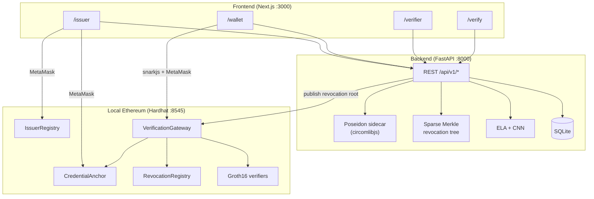
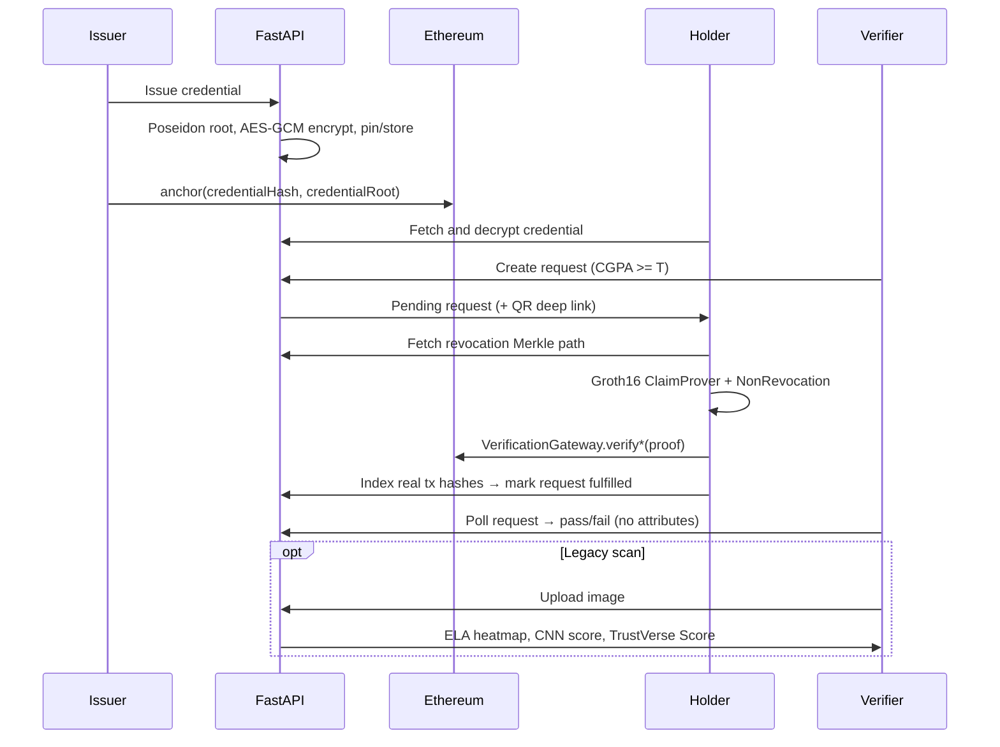

# TrustVerse Architecture

This document explains TrustVerse end to end: what problem it solves, how the pieces fit together, and exactly what happens when an issuer, student, or employer uses the system. It is written so someone new to the repo can understand the design without reading the code first.

---

## 1. What TrustVerse is

TrustVerse is a **privacy-preserving academic credential verification** system. A university issues a degree credential to a student. Later, an employer can check claims such as:

> “This student has CGPA ≥ 8.0 from an accredited university, and the degree has not been revoked.”

…**without** seeing the full transcript, exact CGPA, or other personal attributes.

The system combines four load-bearing pillars:

| Pillar | Role |
|--------|------|
| **W3C Verifiable Credentials** | Off-chain credential document (name, degree, CGPA, dates), encrypted for the holder |
| **Poseidon commitments + Ethereum anchors** | A cryptographic fingerprint of the claims is published on-chain so it cannot be forged later |
| **zk-SNARKs (Groth16)** | The holder proves selective claims and non-revocation in the browser without revealing raw attributes |
| **AI forensics (ELA + CNN)** | Secondary path for *legacy paper/scan* certificates that never entered the cryptographic pipeline |

Visual “scan-to-credential” binding (SDC / VisualBinder) is **research only**. It is not part of the product path. See [§12 Research vs product](#12-research-vs-product).

---

## 2. Roles

Three actors. Each has a dedicated UI page and corresponding API surface.

### Issuer (university)

- Connects MetaMask and registers in `IssuerRegistry` (DID ↔ wallet).
- Issues a degree credential (holder DID, degree name, CGPA, date).
- Backend builds a W3C VC, computes a Poseidon `credentialRoot`, encrypts the VC for the holder, and stores it.
- Issuer’s wallet signs `CredentialAnchor.anchorCredential` so the commitment is on-chain.
- Can revoke a credential (updates the backend Merkle revocation tree and publishes the new root).
- Can batch-issue, ask the backend to relay an anchor, manage templates and staff, and store an API key or webhook URL. Keys are not enforced and webhook URLs are not called.

**UI:** `/issuer`

### Holder (student)

- Opens the wallet connected to the same Ethereum address used in their DID (`did:ethr:<address>`).
- Fetches and decrypts credentials; sees attributes, anchor status, and revocation status.
- Receives verification requests (list or QR deep link `/wallet?request=<id>`).
- Generates Groth16 proofs in the browser (`ClaimProver` + `NonRevocation`) and submits them to `VerificationGateway` via MetaMask.
- Can create a share link. Resolving that link is a server-side predicate check, not a Groth16 proof.

**UI:** `/wallet`, `/present`

### Verifier (employer / admissions)

- Creates a request: predicate (default `cgpa_gte`) + threshold (e.g. CGPA ≥ 8.0) + optional issuer DID. The request expires (default 72 hours) and carries an invite token.
- Shares a deep link / QR with the student.
- Polls until the request is fulfilled; sees **pass/fail**, issuer context, and block/tx reference — **not** the CGPA value or other attributes.
- Optionally uploads a scanned certificate image for ELA heatmap + CNN authenticity + TrustVerse Score.

**UI:** `/verifier`  
**Public lookup (anyone):** `/verify` — paste a credential hash for on-chain anchor + boolean revocation status.  
**Directory:** `/directory` — issuer name, domain, accreditation, and the verified flag.  
**Embed:** `/embed/verify`.

---

## 3. High-level system diagram



**Stack summary**

| Layer | Tech |
|-------|------|
| Frontend | Next.js 14, Tailwind, ethers v6, snarkjs (browser proving) |
| Backend | FastAPI, SQLAlchemy (SQLite), web3.py, PyTorch |
| Crypto | Circom 2, circomlib Poseidon, Groth16, AES-256-GCM |
| Chain | Hardhat / Solidity 0.8.x |

---

## 4. Repository layout

| Path | Purpose |
|------|---------|
| `frontend/` | Issuer, wallet, verifier, and public verify portals |
| `backend/` | Issuance, encryption, revocation tree, forensics, product layer, demo seed |
| `backend/poseidon_sidecar/` | Node + circomlibjs Poseidon (must match Circom bit-for-bit) |
| `backend/models/` | Trained `forgery_cnn.pt` weights |
| `contracts/` | Smart contracts, Hardhat tests, deploy + gas scripts |
| `circuits/` | Circom sources, wasm/zkey/vkey, proof fixtures |
| `eval/` | Reproducible evaluation scripts → `eval/out/` |
| `research/sdc-spike/` | Gated visual-binding research (not product spine) |
| `docs/` | This architecture doc + paper draft |
| `scripts/dev.sh` | One-command local bootstrap |

---

## 5. Cryptographic commitment layout

Every product circuit and the backend share **one** commitment layout. Changing this formula requires regenerating circuits, fixtures, and all existing credentials.

```
claimsHash     = Poseidon(subjectId, cgpaScaled, degreeCode, issueDate)
credentialRoot = Poseidon(claimsHash, issuerPubKey, salt, schemaId)
nullifier      = Poseidon(claimsHash, salt)   // used only for revocation tree position
```

### Field meanings

| Field | Meaning | How it is derived |
|-------|---------|-------------------|
| `subjectId` | Holder identity in the field | `SHA256(holder_did) mod BN128` |
| `cgpaScaled` | Integer CGPA claim | `round(cgpa × 100)` — e.g. 8.9 → `890` |
| `degreeCode` | Degree name | `SHA256(degreeName) mod BN128` |
| `issueDate` | Issuance time | Unix timestamp (seconds) |
| `issuerPubKey` | Issuer binding | Issuer Ethereum address as an integer *(demo simplification; not a Baby Jubjub key)* |
| `salt` | Per-credential blinding | Fresh random field element |
| `schemaId` | Credential schema | `SHA256(schema_id) mod BN128` (e.g. `"degree-v1"`) |

**BN128 field prime** (circom / snarkjs default):

```
21888242871839275222246405745257275088548364400416034343698204186575808495617
```

### Two different “hashes” (do not confuse them)

| Name | Algorithm | Used for |
|------|-----------|----------|
| `credentialRoot` / Poseidon commitment | Poseidon | Selective disclosure proofs; stored as `poseidonCommitment` on `CredentialAnchor` |
| `credentialHash` | SHA-256 of canonical VC JSON | On-chain map key in `CredentialAnchor` / revocation registry |

The gateway requires that a proof’s public `credentialRoot` equals the Poseidon commitment anchored for that `credentialHash`.

### Where Poseidon is computed

- **Backend:** `backend/app/core/commitment.py` → `poseidon.py` → subprocess to `backend/poseidon_sidecar/hash.js` (circomlibjs).
- **Circuits:** `circuits/ClaimProver.circom`, `NonRevocation.circom`, `IssuerMembership.circom`.
- At issuance, the commitment fields are embedded in the VC under `trustverseCommitment` so the wallet can rebuild circuit witnesses later.

---

## 6. End-to-end flows

### 6.1 Canonical happy path (ZK verification)

This is the demo path that must work flawlessly.



### 6.2 Issuance (step by step)

1. Issuer connects MetaMask. DID is typically `did:ethr:<walletAddress>`.
2. **Register (once):**
   - On-chain: `IssuerRegistry.selfRegister(did, metadataHash)` from the connected wallet.
   - Off-chain: `POST /api/v1/issuers/register` so the API knows the issuer.
3. Issuer fills the issue form (holder DID, degree, CGPA, date) and calls `POST /api/v1/credentials/issue`.
4. Backend `issue_credential()`:
   - Builds Poseidon `claimsHash` / `credentialRoot` / `nullifier`.
   - Assembles a W3C Verifiable Credential (v2-shaped) including `trustverseCommitment`.
   - Computes `credentialHash = SHA256(canonical VC JSON)`.
   - Encrypts the VC with AES-256-GCM under a **per-holder key** (see [§11](#11-security-and-privacy-model)).
   - Pins ciphertext (Pinata if configured; otherwise a deterministic local mock CID).
   - Persists a `CredentialRecord` (status `Issued`, encrypted blob, commitment, nullifier, CID).
5. Frontend prompts MetaMask: `CredentialAnchor.anchorCredential(credentialHash, poseidonCommitment, issuerDID, parentHash)`.
6. Frontend confirms with `POST /api/v1/credentials/{credential_hash}/anchored` → status becomes `Active`, stores tx hash.

Signing of the VC itself is wallet/anchor-driven in the demo; there is no `issuer_private_key: 'mock_pk'` path in the UI.

### 6.3 Holder wallet

1. Connect MetaMask → `holderDid = did:ethr:<address>`.
2. `GET /api/v1/credentials/holder/{holderDid}` — server decrypts with the demo key and returns plaintext attributes plus live on-chain anchor / revocation hints.
3. UI shows degree, CGPA, date, Poseidon commitment, Active/Revoked.
4. `GET /api/v1/verify/requests?holder_did=...` lists pending requests. Deep link `/wallet?request=<id>` opens proving directly.
5. On “Prove”:
   - Rebuild ClaimProver witnesses from `trustverseCommitment` (real values, not placeholders).
   - Fetch Merkle non-membership path from the API.
   - Run snarkjs `fullProve` in the browser against wasm + zkey under `/circuits/`.
   - Call gateway verify functions from the holder’s wallet.
   - `POST /api/v1/verify/proof` with **real** tx hashes (mock hashes are rejected).

### 6.4 Verifier request → on-chain verify

1. Verifier `POST /api/v1/verify/requests` with issuer DID (optional), attribute (`cgpa`), threshold as `cgpaScaled` (`round(T × 100)`), expiry.
2. API returns request id and `wallet_deep_link` (`/wallet?request={id}`). UI can show a QR to the full URL.
3. Holder generates and submits proofs (above).
4. Verifier polls `GET /api/v1/verify/requests/{id}` (~3s) until `fulfilled` / `failed`.
5. UI emphasizes that **no attribute values were disclosed** — only the boolean outcome and public metadata (issuer, block/tx).

Requests carry a predicate id (`cgpa_gte` by default), optional `predicate_params`, an expiry (default 72 hours), and an invite token. `GET /api/v1/verify/invite/{token}` resolves the invite. Pending requests past `expires_at` serialize as `expired`. Issuance, revocation, and proof indexing also write an inbox notification for the holder or verifier (`backend/app/core/notify.py`). Email is sent only when `SMTP_HOST` is set; otherwise the notice is stored and logged.

### 6.5 Revocation

TrustVerse maintains **two** related revocation concepts:

| Mechanism | What it is | Used when |
|-----------|------------|-----------|
| **Backend sparse Merkle tree + gateway root** | Privacy-friendly non-membership proofs (`NonRevocation`) | Product revoke UI + ZK path |
| **`RevocationRegistry` on-chain** | Boolean revoke by `credentialHash` with 2-of-3 multi-sig | Gateway also rejects claim proofs if `isRevoked(hash)` |

**Product revoke path (issuer UI):**

1. `POST /api/v1/credentials/revoke` with credential hash + reason.
2. DB status → `Revoked`.
3. Backend sets the SMT leaf for this credential’s `nullifier` to `1`.
4. New tree root is published: `VerificationGateway.updateRevocationTreeRoot(root)` (backend uses the deployer/root-publisher key).
5. Subsequent `NonRevocation` proofs that still cite the old root are rejected (`Stale or invalid revocation tree root`).
6. A holder whose leaf is now `1` cannot produce a valid non-membership proof for the current root.

**Tree details**

- Depth: **20** levels (~1M leaves).
- Leaf value: `0` = not revoked, `1` = revoked.
- Position: low 20 bits of `nullifier = Poseidon(claimsHash, salt)` (LSB-first, matching Circom `Num2Bits`).
- Internal nodes: `Poseidon(left, right)`; empty subtrees are precomputed.

---

## 7. Zero-knowledge circuits

Product circuits live under `circuits/`. Artifacts used by the wallet are copied to `frontend/public/circuits/` by `scripts/dev.sh`.

### Public signal order

Circom lists outputs before public inputs. snarkjs therefore emits:

```
[isValid, publicInput0, publicInput1]
```

| Circuit | `pubSignals` |
|---------|----------------|
| **ClaimProver** | `[isValid, credentialRoot, threshold]` |
| **NonRevocation** | `[isValid, credentialRoot, revocationTreeRoot]` |
| **IssuerMembership** | `[isValid, credentialRoot, issuerRegistryRoot]` |

### ClaimProver

- **Proves:** private claim fields hash to the public `credentialRoot`, and `cgpaScaled ≥ threshold`.
- **Public:** `credentialRoot`, `threshold`.
- **Private:** `subjectId`, `cgpaScaled`, `degreeCode`, `issueDate`, `issuerPubKey`, `salt`, `schemaId`.
- **Does not reveal:** exact CGPA, degree string, salt, subject id.

### NonRevocation

- **Proves:** for this credential’s nullifier position, the Merkle leaf is `0` under the public `revocationTreeRoot`, and the private witnesses are consistent with `credentialRoot`.
- **Public:** `credentialRoot`, `revocationTreeRoot`.
- **Private:** `claimsHash`, `issuerPubKey`, `salt`, `schemaId`, `pathElements[20]`.
- **Tree depth:** 20 (must match backend `SparseMerkleTree`).

### IssuerMembership

- Proves the issuer public key is in a registry Merkle tree (10 levels).
- Solidity verifier is **deployed** and covered by fixture tests, but is **not** routed through `VerificationGateway` in the MVP (standalone).

### Trusted setup

Powers of Tau / Phase 2 in this repo use a **local, non-production** ceremony so demos and CI are reproducible. Do not treat the committed zkeys as production-secure.

### What is *not* in the product path

`VisualBinder.circom` and SDC feature extractors live under `research/sdc-spike/`. They must not be wired into issuance or the gateway until the R1 gate passes (it currently fails — see §12).

---

## 8. Smart contracts

Deployed by `contracts/scripts/deploy.ts` onto local Hardhat (addresses written to `contracts/deployed-addresses.json` and synced into backend/frontend env by `dev.sh`).

### IssuerRegistry

- Maps issuer DID ↔ wallet address; tracks active / suspended state.
- `selfRegister(did, metadataHash)` — university registers from its own wallet.
- Owner-only `registerIssuer` remains for admin/demo seeding.
- Helpers for activity checks and DID lookup by address.

### CredentialAnchor

- `anchorCredential(credentialHash, poseidonCommitment, issuerDID, parentHash)`.
- Batch / Merkle-batch helpers for future bulk issuance.
- `isAnchored` / `getAnchor` for gateway and public verify.

### RevocationRegistry

- Multi-sig style revoke: issuer sets 3 signers; propose + ≥2 approvals execute boolean revoke by `credentialHash`.
- Reason codes (expired, administrative, fraud, …).
- Independent of the privacy-preserving SMT, but consulted by `verifyClaimProof`.

### VerificationGateway

The only contract a holder/verifier needs for ZK verification:

| Function | Checks |
|----------|--------|
| `verifyClaimProof(credentialHash, pA, pB, pC, pubSignals)` | Anchored; not `RevocationRegistry.isRevoked`; `pubSignals[1]` matches anchored Poseidon; Groth16 ClaimProver verifier accepts |
| `verifyNonRevocationProof(...)` | Anchored; Poseidon matches; `pubSignals[2] == revocationTreeRoot`; Groth16 NonRevocation verifier accepts |
| `updateRevocationTreeRoot(newRoot)` | Only `revocationRootPublisher` (initially deployer; used by backend) |

Events: `VerificationSuccessful`, `VerificationFailed`, `RevocationTreeRootUpdated`.

### Groth16 verifiers

Generated Solidity under `contracts/contracts/verifiers/`:

- `ClaimProverVerifier`
- `NonRevocationVerifier`
- `IssuerMembershipVerifier`

Each exposes `verifyProof(_pA, _pB, _pC, _pubSignals[3])`.

---

## 9. Backend API surface

All product routes are under **`/api/v1`**. OpenAPI docs: `http://localhost:8000/docs`.

### Issuers

| Method | Path | Purpose |
|--------|------|---------|
| POST | `/api/v1/issuers/register` | Persist issuer after/with on-chain registration |
| GET | `/api/v1/issuers/` | List issuers |
| GET | `/api/v1/issuers/{did}` | Fetch one issuer |

### Credentials

| Method | Path | Purpose |
|--------|------|---------|
| POST | `/api/v1/credentials/issue` | Build VC, Poseidon root, encrypt, store |
| POST | `/api/v1/credentials/{credential_hash}/anchored` | Mark Active after MetaMask anchor |
| GET | `/api/v1/credentials/holder/{holder_did}` | Decrypt + return holder credentials |
| GET | `/api/v1/credentials/issuer/{issuer_did}` | List issuer’s credentials |
| POST | `/api/v1/credentials/revoke` | Revoke + update SMT + publish root |
| GET | `/api/v1/credentials/revocation/proof/{credential_hash}` | Merkle path for NonRevocation |
| GET | `/api/v1/credentials/revocation/root` | Current tree root |

### Verification

| Method | Path | Purpose |
|--------|------|---------|
| POST | `/api/v1/verify/requests` | Create threshold request |
| GET | `/api/v1/verify/requests` | List (filter by `holder_did`) |
| GET | `/api/v1/verify/requests/{request_id}` | Poll status |
| POST | `/api/v1/verify/proof` | Index real on-chain txs; fulfill request |
| GET | `/api/v1/verify/{credential_hash}` | Public anchor + revocation lookup |

### Forensics & score

| Method | Path | Purpose |
|--------|------|---------|
| POST | `/api/v1/forensics/analyze` | ELA heatmap + CNN authenticity |
| POST | `/api/v1/forensics/phash` | Perceptual hash |
| POST | `/api/v1/trust-score/compute` | Weighted TrustVerse Score |

### Demo

| Method | Path | Purpose |
|--------|------|---------|
| POST | `/api/v1/demo/seed` | Seed university, Alice, Bob, pending request |

`GET /` returns a welcome JSON payload. `GET /health` returns `{"status":"ok"}`.

On startup, `Base.metadata.create_all` creates new tables and `ensure_columns()` in `backend/app/db/migrate.py` adds missing columns to an existing SQLite file. That migration is additive (`ALTER TABLE ... ADD COLUMN` only).

Issuer registration accepts optional `domain` and `accreditation`. Profile responses include those fields plus `verified`, and `GET /api/v1/issuers/{did}` counts issued, revoked, and verification rows instead of returning zeros.

Credential issue accepts optional `holder_email`, `holder_pubkey`, `template_id`, and `claim_invite` (default true). A claim token is stored when `claim_invite` is true. Holder and issuer list payloads include `holder_email`, `claim_token`, `claimed_at`, and `enc_scheme`.

### Product layer (`/api/v1/product`)

These routes sit beside the ZK path. They are implemented in `backend/app/api/endpoints/product.py`. The issuer portal, holder wallet, directory, and present page call the ones marked **UI**. The rest are API-only.

| Method | Path | Purpose |
|--------|------|---------|
| GET | `/api/v1/product/predicates` | Predicate catalog (labels, disclosed fields, circuit name) |
| GET | `/api/v1/product/notifications?did=` | Inbox for one DID, newest 50. **UI** (header bell) |
| POST | `/api/v1/product/notifications/{id}/read` | Mark one notification read. **UI** |
| GET | `/api/v1/product/events` | Trust events, filter by `actor_did` or `target_did` |
| POST | `/api/v1/product/shares` | Create a time-limited share link. **UI** (wallet and `/present`) |
| GET | `/api/v1/product/shares?holder_did=` | List a holder's shares |
| GET | `/api/v1/product/shares/{token}` | Resolve a share. See the caveat below |
| POST | `/api/v1/product/shares/{token}/revoke` | Revoke a share |
| GET | `/api/v1/product/templates?issuer_did=` | List templates; creates a default degree template if empty. **UI** |
| POST | `/api/v1/product/templates` | Create or update a template. **UI** |
| GET | `/api/v1/product/directory` | Active issuers with domain, accreditation, issued count. **UI** (`/directory`) |
| POST | `/api/v1/product/directory/verify` | Sets `domain`, `verified=true`, and optional accreditation. Does **not** check DNS or `did:web` |
| POST | `/api/v1/product/presentations` | Store a W3C Verifiable Presentation payload |
| GET | `/api/v1/product/presentations/{id}` | Fetch one presentation |
| GET | `/api/v1/product/analytics?did=&role=` | Counts for issuer, verifier, or holder |
| GET/POST | `/api/v1/product/staff` | List or add issuer staff (`admin`, `registrar`, `viewer`). **UI** |
| GET/POST | `/api/v1/product/webhooks` | Store a webhook URL, event list, and secret. **UI** stores them; nothing in the API delivers events to the URL |
| GET/POST | `/api/v1/product/keys` | Store a SHA-256 hash of an API key and return the raw key once. **UI** creates keys; routes do not require them |
| POST | `/api/v1/product/credentials/batch` | Issue many credentials (optional `did:email:` holder). **UI**. Records stay `Issued` until anchored |
| POST | `/api/v1/product/relay/anchor` | Backend wallet calls `anchor_on_chain` (sponsored anchor). **UI** |
| GET | `/api/v1/product/health` | Feature list for this router |

**Share resolution is not a ZK proof.** `GET /shares/{token}` decrypts the credential on the server and runs `evaluate_predicate()`. The JSON reports pass/fail and does not include raw attributes, but the server saw them. The cryptographic selective-disclosure path is still ClaimProver plus NonRevocation on `VerificationGateway`.

**Predicate catalog** (`backend/app/core/predicates.py`):

| Id | What it checks | Where pass/fail is decided |
|----|----------------|----------------------------|
| `cgpa_gte` | `cgpaScaled >= threshold` | Groth16 ClaimProver, then the gateway |
| `degree_eq` | Degree title string equality | Server, against decrypted subject |
| `year_range` | Issue year inside `[from_year, to_year]` | Server |
| `graduated` | Credential status is active or issued | Server (NonRevocation is a separate proof the holder may still submit) |
| `issuer_set` | Issuer DID is in a comma-separated allow-list | Server. The IssuerMembership circuit is not on this path |

`/present` creates a 24-hour share for the holder's first credential with predicate `graduated` and shows a QR to `/verify?share=...`. `/embed/verify` accepts `?hash=` (on-chain public lookup) or `?share=` (the server-side share check).

---

## 10. AI forensics and TrustVerse Score

Cryptographic verification is the primary trust path. Forensics exists for **legacy scans** (PDF/image of a paper certificate) when no ZK credential is available.

### Pipeline

1. **ELA (Error Level Analysis):** recompress as JPEG (quality 90), subtract from original, amplify differences → heatmap (returned as a data-URL PNG).
2. **CNN (`ForgeryDetectionCNN`):** 128×128 ELA tensor → small ConvNet → sigmoid authenticity ∈ [0, 1]. Decision threshold typically `0.6`.
3. Weights load from `backend/models/forgery_cnn.pt` at startup. If missing, the service **fails loudly** (no silent random weights). Train with `backend/notebooks/train_forgery_cnn.py` (synthetic TrustVerse certificates; DocTamper/CASIA optional if you have access).

### TrustVerse Score weights

Implemented in `backend/app/core/trust_score.py`:

| Component | Weight | Contribution |
|-----------|--------|--------------|
| AI authenticity | 0.40 | `ai_score × 40` |
| Issuer reputation | 0.30 | Full points if issuer treated as verified |
| On-chain (not revoked) | 0.20 | Full points if not revoked |
| Lineage depth | 0.10 | `min(depth, 3) / 3 × 10` |

Fatal conditions (revoked credential or unverified issuer in the score engine) collapse the score to **0**. Status bands: ≥90 EXCELLENT, ≥75 GOOD, ≥50 WARNING, else DANGEROUS.

The verifier UI shows components explicitly next to the upload. Scan uploads without a real credential hash are a **secondary** demo path and should not be confused with the ZK happy path.

---

## 11. Security and privacy model

### What the verifier learns (ZK path)

- The proof(s) verified on-chain for an anchored credential.
- That `cgpaScaled ≥ threshold` (threshold is public by design).
- That the credential was not revoked at the published Merkle root (and, on the claim path, not flagged in `RevocationRegistry`).
- Issuer / block / tx metadata as shown in the UI.

### What the verifier does **not** learn

- Exact CGPA, degree string, salt, subject id, or full VC contents.
- Other attributes in the encrypted credential.

### Threat-model notes and honest limitations

| Topic | Current behavior | Production intent |
|-------|------------------|-------------------|
| Holder encryption | If `holder_pubkey` is stored: AES key = `SHA256("trustverse-ecies:" + pubkey hex)`. That is a key derivation from the public key, not ECIES; anyone who can read the pubkey column can decrypt. Otherwise the legacy demo key `SHA256("trustverse-demo-key:" + holder_did)` | Real ECIES so only the holder secret key opens the credential |
| Issuer binding in-circuit | `issuerPubKey` = Ethereum address as int | Dedicated circuit-friendly issuer key + signature |
| Groth16 setup | Local reproducible ceremony | Proper multi-party ceremony |
| IPFS | Mock CID when Pinata keys unset | Real pinning |
| Auth | Wallet-based role detection only. API keys are stored and shown once; no route checks them | Enough for thesis/demo; no SIWE/JWT required by design |
| Issuer "verified" flag | `POST /api/v1/product/directory/verify` sets `verified=true` for a domain string. No DNS or `did:web` proof | Domain-control check before the flag flips |
| Share links | Server decrypts and evaluates the predicate | Same statement as a Groth16 proof, or stop calling the share result a proof |
| Webhooks | URL and secret are stored | Delivery on trust events |

Unlinkability is limited by demo choices (stable DIDs, deterministic encryption). Fresh salts per credential do prevent trivial reuse of the same Poseidon root across issuances.

---

## 12. Research vs product

| Area | Status |
|------|--------|
| ClaimProver + NonRevocation + gateway | **Product** |
| Backend SMT revocation + root publish | **Product** |
| Issuer registration / anchor / revoke UI | **Product** |
| Inbox, directory, templates, staff, batch issue, relay anchor | **Product** (off-chain). Relay anchor uses the backend wallet |
| Share links and `degree_eq` / `year_range` / `graduated` / `issuer_set` | **Product UI, not ZK.** Pass/fail is `evaluate_predicate()` on the server |
| API keys and webhooks | **Stored only.** Keys are not enforced; webhook URLs are not called |
| ELA-CNN forensics | **Product (secondary)** |
| IssuerMembership in gateway | Deployed verifier only; not MVP-wired |
| VisualBinder / DCT-SDC | **Research** — 0% FRR, **100% FAR** on synthetic tampers |
| Region-hash R1 spike | **Research** — gate FAR &lt; 10% @ FRR &lt; 5% **failed** (~4.4% FRR, ~77.8% FAR); see `research/sdc-spike/results/r1_gate.json` |

Do **not** merge VisualBinder or `sdcHash` into `ClaimProver` / the commitment layout until a redesigned feature clears the gate.

---

## 13. Demo mode

Cold demos should need zero manual data entry.

`POST /api/v1/demo/seed` (also invoked by `scripts/dev.sh`) creates:

| Entity | Detail |
|--------|--------|
| University | `did:ethr:trustverse-university`, Hardhat account #0, domain `trustverse.university`, accreditation `NAAC A++`, `verified=true` |
| Alice (holder) | Hardhat #1 — CGPA **8.9**, Active, anchored |
| Bob (holder) | Hardhat #2 — CGPA **6.4**, **Revoked** (SMT leaf set) |
| Pending request | Hardhat #3 as verifier → Alice, `cgpa` ≥ **8.0** (`threshold = 800`) |

Landing page **Run guided demo** hits the same seed endpoint. Suggested MetaMask accounts: **#0 issuer**, **#1 Alice**, **#3 verifier**.

---

## 14. Local development bootstrap

```bash
./scripts/dev.sh
```

What it does:

1. Starts a Hardhat node and deploys the full contract suite.
2. Writes addresses into `backend/.env` and `frontend/.env.local`.
3. Starts FastAPI on `:8000`.
4. Trains the CNN on first run if `forgery_cnn.pt` is missing.
5. Seeds demo data via `/api/v1/demo/seed`.
6. Copies ClaimProver / NonRevocation wasm+zkey into `frontend/public/circuits/`.
7. Starts Next.js on `:3000`.

Ctrl-C tears down Hardhat, API, and frontend. Logs: `.hardhat-node.log`, `.backend.log`, `.frontend.log`.

**Manual alternative:** see root `README.md`.

**Evaluation:** `bash eval/run_all.sh` (circuit sizes, proof times, latency; gas report needs a live Hardhat node). Paper framing: `docs/paper_draft.md`.

---

## 15. Frontend route map

| Route | Audience | Job |
|-------|----------|-----|
| `/` | Everyone | Product narrative + guided demo |
| `/get-started` | Everyone | Role picker (holder, issuer, verifier) into the matching portal |
| `/issuer` | University | Register, issue, MetaMask or relay anchor, revoke, templates, batch issue, staff, API keys, webhook URL |
| `/wallet` | Student | Decrypt credentials, inbox-driven requests, answer proofs, create a share |
| `/verifier` | Employer | Predicate picker, create requests, poll results, optional scan upload |
| `/verify` | Public | Anchor + revocation lookup by credential hash |
| `/directory` | Public | Issuer list with domain, accreditation, and the verified flag |
| `/present` | Holder | QR for a 24-hour `graduated` share of the first credential |
| `/embed/verify` | Embed | `?hash=` public lookup or `?share=` server-side predicate result |
| `/demo/...` | Guided demo | Same portals under the demo service (`/demo/issuer`, `/demo/wallet`, `/demo/verifier`, `/demo/verify`, `/demo/directory`, `/demo/present`) |

Contract ABIs/addresses and `API_URL` are centralized in `frontend/src/lib/contracts.ts`.

---

## 16. Design principles (why it looks like this)

1. **One commitment layout everywhere** — backend Poseidon sidecar and Circom must agree, or proofs fail.
2. **On-chain holds fingerprints and proofs, not transcripts** — privacy by default for the employer path.
3. **Revocation freshness is enforced** — stale Merkle roots are rejected at the gateway.
4. **Forensics is fallback, not the spine** — a student CNN will not beat large pretrained forensics models; it supports legacy documents and a second evaluation table.
5. **Honest research boundaries** — failed visual binding is documented as a negative result, not papered over.
6. **Predicate names are not proofs** — only `cgpa_gte` is ClaimProver. Directory "verified", share pass/fail, API keys, and webhooks are product records with the limits in §11.

If you are implementing a change, ask: does it touch the commitment layout, the tree depth, or public signal order? Those three are the most expensive to get wrong.
