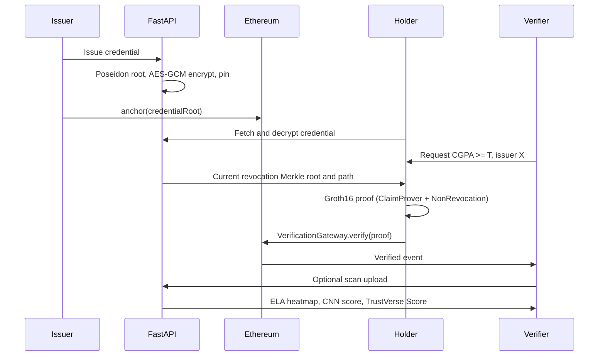

# TrustVerse Architecture

TrustVerse verifies academic credentials with **privacy-preserving selective disclosure** (zk-SNARKs), **on-chain anchoring and revocation**, and an optional **ELA-CNN forensics** path for legacy scans.

## Roles

| Role | Responsibility |
|------|----------------|
| Issuer (university) | Registers on-chain, issues encrypted W3C VCs, anchors Poseidon commitments |
| Holder (student) | Decrypts credentials in wallet, generates ZK proofs for verifier requests |
| Verifier (employer) | Creates threshold requests, verifies proofs on-chain, optional scan upload |

## Commitment layout

```
claimsHash     = Poseidon(subjectId, cgpaScaled, degreeCode, issueDate)
credentialRoot = Poseidon(claimsHash, issuerPubKey, salt, schemaId)
```

Backend and Circom circuits share the same Poseidon implementation via `backend/poseidon_sidecar/` (circomlibjs).

## Canonical happy path



## Components

### Frontend (Next.js)

- `/issuer` — register issuer, issue credential, MetaMask anchor, revoke
- `/wallet` — decrypt credentials, pending verification requests, in-browser snarkjs proving
- `/verifier` — create requests, QR deep link, poll results, upload scans
- `/verify` — public anchor + revocation lookup by `credentialRoot`

### Backend (FastAPI)

- Credential issuance with real Poseidon commitments and per-holder encryption
- Sparse Merkle revocation tree (20 levels), root published to `VerificationGateway`
- Verification request CRUD and proof indexer (listens for on-chain events)
- ELA + CNN forensics (`backend/app/core/ai_forensics.py`)
- Demo seed: `/demo/seed` — university, two students, one revoked credential, pending request

### Smart contracts (Hardhat)

- `IssuerRegistry` — issuer DID ↔ wallet
- `CredentialAnchor` — `credentialHash` → Poseidon commitment
- `RevocationRegistry` — multi-sig revocation proposals
- `VerificationGateway` — routes Groth16 verifiers, enforces anchor match and revocation tree root
- `verifiers/` — ClaimProver, NonRevocation, IssuerMembership Groth16 verifiers

### Circuits (Circom)

- **ClaimProver** — prove `cgpaScaled >= threshold` without revealing CGPA
- **NonRevocation** — Merkle non-membership in revocation tree
- **IssuerMembership** — issuer public key in registry tree (standalone verifier; not in gateway MVP)

Visual binding (`VisualBinder`, SDC) lives under `research/sdc-spike/` and is **not** on the product path until R1 gate passes.

## TrustVerse Score (legacy scans)

When a verifier uploads a scan, the backend returns:

1. On-chain anchor / issuer signals (if credential root known)
2. Revocation status
3. ELA heatmap + CNN forgery probability
4. Weighted **TrustVerse Score** with components shown explicitly in the UI

## Local development

```bash
./scripts/dev.sh
```

Starts Hardhat, deploys contracts, writes addresses to `backend/.env` and `frontend/.env.local`, runs API on `:8000` and frontend on `:3000`.

Seed demo data: `POST http://localhost:8000/demo/seed`

## Evaluation

Reproducible metrics under `eval/` — see `eval/run_all.sh` and `docs/paper_draft.md`.
