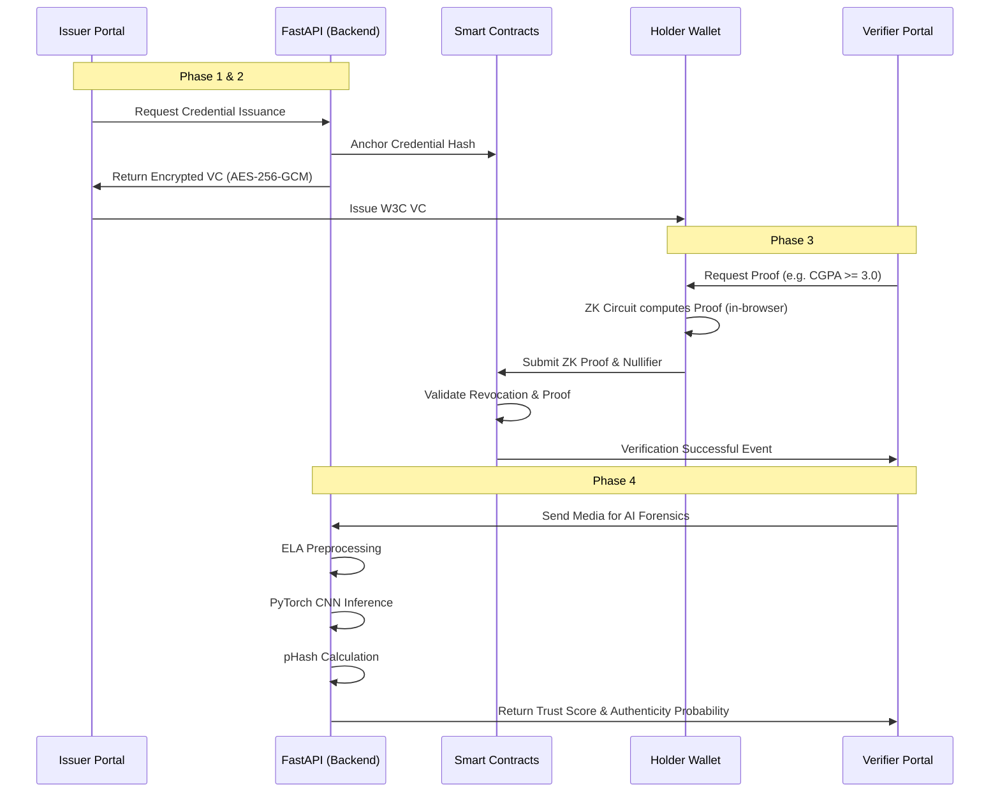
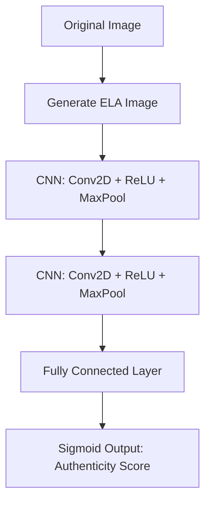

# TrustVerse: Digital Trust Infrastructure

## Introduction

TrustVerse is an advanced Digital Trust Infrastructure that unifies decentralized identities (DIDs), Zero-Knowledge Proofs (ZKPs), and AI forensics into a single platform. It addresses the growing threat of sophisticated digital manipulation and AI-generated forgeries by anchoring trust immutably on a blockchain ledger.

## Core Pillars

1. **W3C Verifiable Credentials & DIDs**: Standards-compliant credentials signed mathematically by authorized issuers.
2. **Zero-Knowledge Selective Disclosure**: Prove possession and attributes of credentials without exposing the actual data using `circom` and `snarkjs` (Groth16).
3. **AI Forensics Pipeline**: Deepfake detection and document tampering analysis embedded natively into verification.

---

## Architecture Overview

The system architecture consists of a Next.js frontend (acting as Holder Wallet and Issuer/Verifier Portals), a FastAPI python backend (handling the heavy AI inference and credential issuance logic), and a Smart Contract layer on Ethereum (Hardhat).

### High-Level Interaction Diagram

---

## Phase 4: AI Forensics Pipeline Theory

### 1. Error Level Analysis (ELA)

When an image is saved in a lossy format (like JPEG), compression artifacts are introduced. When an image is modified (tampered with) and re-saved, the modified sections undergo compression a different number of times than the original sections.
Error Level Analysis highlights these discrepancies. 

By saving the image at a known quality (e.g., 90%) and subtracting it from the original, we can visualize areas that have different compression error levels. The CNN will use these ELA images as input because tampered regions "light up" prominently.

### 2. PyTorch CNN Architecture

The Convolutional Neural Network (CNN) is designed to learn structural anomalies in ELA-processed images. 
- **Input**: ELA-processed RGB images.
- **Hidden Layers**: Sequential Conv2D layers with ReLU activation, MaxPooling, and Dropout for regularization.
- **Output**: Binary classification (Authentic vs. Forged) or probability map.

### 3. Perceptual Hashing (pHash)

Unlike cryptographic hashes (SHA-256) which change entirely if a single bit changes, a perceptual hash computes a fingerprint of the image's visual features. 
- **Use Case**: Used by the Verifier to check if this image (or a slightly cropped/resized version of it) has been previously flagged or verified.
- **Mechanism**: Calculates the Discrete Cosine Transform (DCT) of the image, isolates the low frequencies, and compares values against the mean to generate a robust binary hash.
